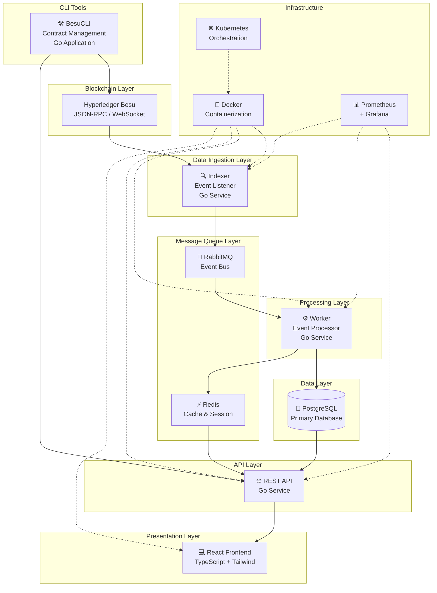

# 🏗️ Arquitetura Geral do BesuScan

## 📋 Visão Geral

O BesuScan é construído seguindo uma **arquitetura de microsserviços** orientada a eventos, projetada para alta performance, escalabilidade e manutenibilidade. O sistema é composto por 5 componentes principais que trabalham de forma independente e comunicam-se através de mensageria assíncrona.

## 🎯 Princípios Arquiteturais

### 1. **Event-Driven Architecture**
- Comunicação assíncrona via RabbitMQ
- Desacoplamento entre componentes
- Processamento paralelo e distribuído
- Resiliência a falhas

### 2. **Microservices Pattern**
- Cada serviço tem responsabilidade única
- Deploy independente
- Escalabilidade horizontal
- Tecnologias específicas por domínio

### 3. **Clean Architecture**
- Separação clara de responsabilidades
- Inversão de dependências
- Testabilidade
- Facilidade de manutenção

## 🔄 Diagrama da Arquitetura



## 🔧 Componentes Principais

### 1. 🔍 **Indexer (Listener da Blockchain)**

**Responsabilidade**: Monitora a blockchain Besu e captura eventos em tempo real.

**Funcionalidades**:
- Conexão WebSocket/HTTP com o nó Besu
- Escuta de novos blocos (`newHeads`)
- Captura de transações pending (`pendingTransactions`)
- Monitoramento de eventos de contratos (`logs`)
- Detecção de reorganizações de cadeia
- Publicação de eventos no RabbitMQ

**Tecnologia**: Go com `go-ethereum` client

**Queues Produzidas**:
- `blocks.new` - Novos blocos minerados
- `transactions.new` - Novas transações
- `events.new` - Eventos de contratos
- `mempool.update` - Atualizações do mempool

### 2. ⚙️ **Worker (Processador de Eventos)**

**Responsabilidade**: Processa eventos do RabbitMQ e persiste dados no banco.

**Funcionalidades**:
- Consumo de eventos do RabbitMQ
- Processamento paralelo com goroutines
- Enriquecimento de dados (metadata, tags, analytics)
- Persistência em batch no PostgreSQL
- Cache de dados críticos no Redis
- Cálculo de métricas e estatísticas

**Tecnologia**: Go com padrão Domain-Driven Design

**Handlers Especializados**:
- `BlockHandler` - Processa blocos
- `TransactionHandler` - Processa transações
- `EventHandler` - Processa eventos de contratos
- `AccountHandler` - Atualiza dados de contas
- `ValidatorHandler` - Monitora validadores QBFT

### 3. 🌐 **API REST (Interface de Consulta)**

**Responsabilidade**: Fornece interface HTTP para consulta de dados.

**Funcionalidades**:
- Endpoints RESTful para todos os recursos
- Autenticação JWT
- Rate limiting
- Cache inteligente com Redis
- Paginação e filtros avançados
- WebSocket para dados em tempo real
- Documentação OpenAPI/Swagger

**Tecnologia**: Go com Gin framework

**Principais Endpoints**:
- `/api/blocks` - Consulta de blocos
- `/api/transactions` - Consulta de transações
- `/api/accounts` - Dados de contas
- `/api/contracts` - Smart contracts
- `/api/events` - Eventos de contratos
- `/api/stats` - Estatísticas da rede

### 4. 💻 **Frontend React (Interface do Usuário)**

**Responsabilidade**: Interface web moderna para exploração da blockchain.

**Funcionalidades**:
- Dashboard com métricas em tempo real
- Explorador de blocos e transações
- Gestão de smart contracts
- Sistema de busca avançada
- Visualizações e gráficos
- Temas dark/light
- PWA (Progressive Web App)

**Tecnologia**: React + TypeScript + Tailwind CSS

**Principais Páginas**:
- Dashboard principal
- Lista de blocos
- Detalhes de transações
- Explorador de contratos
- Analytics da rede
- Gestão de contas

### 5. 🛠️ **BesuCLI (Ferramenta de Linha de Comando)**

**Responsabilidade**: CLI para deploy e gestão de smart contracts.

**Funcionalidades**:
- Deploy de contratos via YAML
- Verificação automática de contratos
- Interação com contratos (read/write)
- Gestão de proxies UUPS
- Templates para contratos comuns
- Integração com o BesuScan API

**Tecnologia**: Go com Cobra CLI framework

## 🔄 Fluxo de Dados

### 1. **Captura de Dados**
```
Besu Node → WebSocket → Indexer → RabbitMQ
```

### 2. **Processamento**
```
RabbitMQ → Worker → PostgreSQL + Redis
```

### 3. **Consulta**
```
PostgreSQL/Redis → API → Frontend/CLI
```

### 4. **Tempo Real**
```
Indexer → WebSocket → Frontend (updates instantâneos)
```

## 🚀 Padrões Implementados

### 1. **CQRS (Command Query Responsibility Segregation)**
- **Write Side**: Worker processa comandos (eventos)
- **Read Side**: API serve queries otimizadas
- Separação clara entre escrita e leitura

### 2. **Event Sourcing**
- Todos os eventos são armazenados
- Possibilidade de replay de eventos
- Auditoria completa do sistema

### 3. **Repository Pattern**
- Abstração da camada de dados
- Facilita testes unitários
- Permite troca de implementação

### 4. **Dependency Injection**
- Inversão de controle
- Facilita mocking para testes
- Configuração centralizada

## 🔧 Tecnologias por Camada

### **Backend Services**
- **Linguagem**: Go 1.21+
- **HTTP Framework**: Gin
- **ORM**: GORM
- **Blockchain Client**: go-ethereum
- **CLI Framework**: Cobra

### **Frontend**
- **Framework**: React 18
- **Linguagem**: TypeScript
- **Styling**: Tailwind CSS
- **State Management**: Zustand
- **Routing**: React Router
- **Charts**: Recharts

### **Infrastructure**
- **Database**: PostgreSQL 15
- **Cache**: Redis 7
- **Message Queue**: RabbitMQ 3
- **Containerization**: Docker
- **Orchestration**: Kubernetes
- **Monitoring**: Prometheus + Grafana

## 📊 Características de Performance

### **Throughput**
- **Indexer**: 1000+ blocos/segundo
- **Worker**: 500+ transações/segundo
- **API**: 10000+ requests/segundo
- **Frontend**: Sub-segundo loading

### **Latência**
- **Block Indexing**: < 100ms
- **API Response**: < 50ms (cached)
- **WebSocket Updates**: < 10ms
- **Database Queries**: < 10ms (indexed)

### **Escalabilidade**
- **Horizontal**: Múltiplas instâncias de cada serviço
- **Vertical**: Otimizações de CPU e memória
- **Database**: Sharding e read replicas
- **Cache**: Distributed Redis cluster

## 🔒 Aspectos de Segurança

### **Autenticação & Autorização**
- JWT tokens com refresh
- Role-based access control (RBAC)
- API key management
- Rate limiting por usuário

### **Data Protection**
- Criptografia em trânsito (TLS)
- Sanitização de inputs
- SQL injection protection
- XSS prevention

### **Infrastructure Security**
- Network policies no Kubernetes
- Secrets management
- Regular security updates
- Monitoring de anomalias

## 🔄 Resiliência e Recuperação

### **Fault Tolerance**
- Circuit breaker pattern
- Retry com backoff exponencial
- Health checks automáticos
- Graceful degradation

### **Backup & Recovery**
- Backup automático do PostgreSQL
- Point-in-time recovery
- Disaster recovery procedures
- Data replication

### **Monitoring**
- Métricas de performance
- Alertas automáticos
- Distributed tracing
- Log aggregation

## 🎯 Benefícios da Arquitetura

### ✅ **Vantagens**
- **Escalabilidade**: Cada componente escala independentemente
- **Manutenibilidade**: Código organizado e testável
- **Performance**: Processamento paralelo e cache inteligente
- **Flexibilidade**: Fácil adição de novos recursos
- **Confiabilidade**: Tolerância a falhas e recuperação automática

### ⚠️ **Trade-offs**
- **Complexidade**: Mais componentes para gerenciar
- **Latência de Rede**: Comunicação entre serviços
- **Consistência**: Eventual consistency em alguns casos
- **Debugging**: Rastreamento distribuído necessário

## 📈 Roadmap Arquitetural

### **Curto Prazo**
- [ ] Implementação de tracing distribuído
- [ ] Otimizações de cache
- [ ] Health checks melhorados
- [ ] Metrics dashboard

### **Médio Prazo**
- [ ] Multi-tenancy
- [ ] GraphQL API
- [ ] Event replay system
- [ ] Advanced analytics

### **Longo Prazo**
- [ ] Machine learning insights
- [ ] Cross-chain support
- [ ] Advanced governance
- [ ] Enterprise features

---

[⬅️ Voltar ao Índice](./README.md) | [➡️ Próximo: Fluxo de Dados](./02-fluxo-dados.md)
