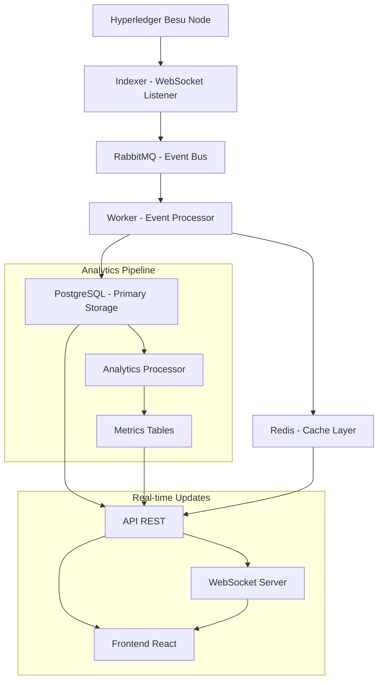
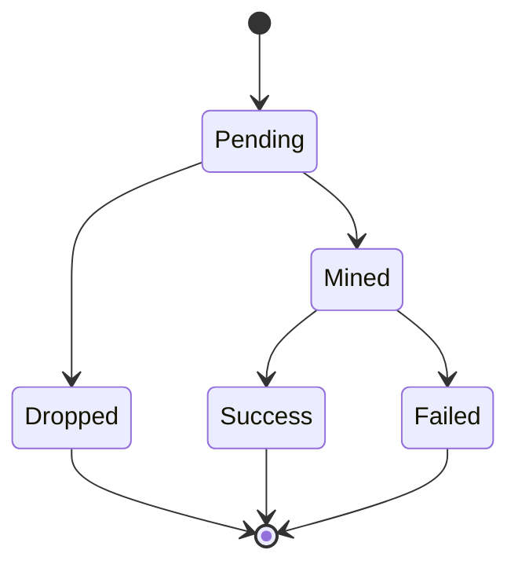
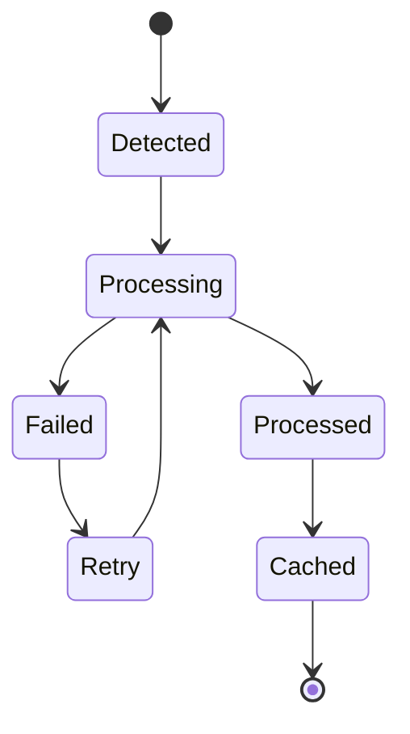

# 🔄 Fluxo de Dados no BesuScan

## 📋 Visão Geral

O BesuScan processa dados da blockchain através de um fluxo bem definido que garante consistência, performance e confiabilidade. Este documento detalha como os dados fluem desde a captura na blockchain até a apresentação no frontend.

## 🌊 Fluxo Principal de Dados



## 📊 Tipos de Dados Processados

### 1. **Dados de Blocos**
- **Origem**: Besu node via `eth_subscribe("newHeads")`
- **Frequência**: ~4 segundos (QBFT consensus)
- **Volume**: ~1 bloco/4s = 21.600 blocos/dia
- **Processamento**: Tempo real + batch

### 2. **Dados de Transações**
- **Origem**: Blocos minerados + mempool
- **Frequência**: Variável (0-100+ tx/bloco)
- **Volume**: Dependente da atividade da rede
- **Estados**: pending → mined (success/failed)

### 3. **Eventos de Contratos**
- **Origem**: Transaction receipts + logs
- **Frequência**: Por transação que interage com contratos
- **Volume**: 0-N eventos por transação
- **Tipos**: Transfer, Approval, Custom events

### 4. **Dados de Contas**
- **Origem**: Transações + state queries
- **Frequência**: Por atividade da conta
- **Volume**: Crescimento incremental
- **Métricas**: Saldo, nonce, atividade

## 🔄 Fases do Processamento

### **Fase 1: Captura (Indexer)**

#### **1.1 Block Listener**
```
Besu WebSocket → New Block Header → Extract Block Data → Validate → Queue
```

**Processo Detalhado**:
1. Conexão WebSocket permanente com Besu
2. Subscrição para `newHeads`
3. Recebimento de header do novo bloco
4. Busca de dados completos via RPC
5. Validação de integridade
6. Publicação na fila `blocks.new`

**Dados Capturados**:
- Número e hash do bloco
- Timestamp e minerador
- Gas usado e limite
- Número de transações
- Merkle roots e metadados

#### **1.2 Transaction Listener**
```
Block Data → Extract Transactions → Decode Methods → Queue
```

**Processo Detalhado**:
1. Extração de transações do bloco
2. Análise de input data
3. Decodificação de métodos de contratos
4. Classificação por tipo
5. Publicação na fila `transactions.new`

#### **1.3 Event Listener**
```
Transaction Receipt → Extract Logs → Decode Events → Queue
```

**Processo Detalhado**:
1. Obtenção de receipts das transações
2. Extração de logs/eventos
3. Decodificação automática de eventos conhecidos
4. Classificação por contrato e tipo
5. Publicação na fila `events.new`

### **Fase 2: Processamento (Worker)**

#### **2.1 Block Processing**
```
Queue Message → Fetch Full Data → Transform → Batch → Persist
```

**Pipeline de Processamento**:
1. **Deserialização**: Converter mensagem JSON
2. **Enrichment**: Buscar dados completos no Besu
3. **Transformation**: Converter para entidades de domínio
4. **Validation**: Verificar integridade e consistência
5. **Batching**: Agrupar para inserção eficiente
6. **Persistence**: Inserir no PostgreSQL
7. **Caching**: Atualizar cache Redis

#### **2.2 Transaction Processing**
```
Queue Message → Decode Input → Calculate Fees → Update Accounts → Persist
```

**Enriquecimento de Dados**:
- Decodificação de métodos de contratos
- Cálculo de fees (gas * price)
- Classificação de tipo de transação
- Atualização de métricas de contas
- Rastreamento de interações

#### **2.3 Event Processing**
```
Queue Message → Decode ABI → Extract Participants → Update Analytics → Persist
```

**Processamento Especializado**:
- **ERC-20**: Transfer, Approval events
- **ERC-721**: NFT transfers
- **ERC-1155**: Multi-token operations
- **Custom**: Eventos específicos de contratos
- **Factory**: Criação de novos contratos

### **Fase 3: Armazenamento**

#### **3.1 PostgreSQL (Primary Storage)**
```
Batch Data → Transaction → Insert/Update → Commit → Index Update
```

**Estratégias de Inserção**:
- **Batch Inserts**: 10-50 registros por lote
- **Upsert Operations**: INSERT ON CONFLICT UPDATE
- **Transaction Safety**: Rollback em caso de erro
- **Index Maintenance**: Atualização automática

#### **3.2 Redis (Cache Layer)**
```
Critical Data → Serialize → Set with TTL → Expire Management
```

**Camadas de Cache**:
- **L1 (30s TTL)**: Último bloco, stats básicas
- **L2 (30min TTL)**: Blocos individuais, contratos
- **L3 (24h TTL)**: Dados históricos, analytics

### **Fase 4: Servir Dados (API)**

#### **4.1 Query Processing**
```
HTTP Request → Parse → Cache Check → Database Query → Transform → Response
```

**Otimizações**:
- **Cache First**: Verificar Redis antes do banco
- **Query Optimization**: Usar índices apropriados
- **Result Pagination**: Limitar resultados
- **Response Caching**: Cache de responses HTTP

#### **4.2 Real-time Updates**
```
Data Change → WebSocket Broadcast → Client Update
```

**Canais WebSocket**:
- `blocks`: Novos blocos
- `transactions`: Transações recentes
- `events`: Eventos de contratos
- `stats`: Estatísticas da rede

## ⚡ Otimizações de Performance

### **1. Parallel Processing**
```go
// Processamento paralelo de blocos
for i := 0; i < numWorkers; i++ {
    go func(workerID int) {
        for block := range blockChannel {
            processBlock(block)
        }
    }(i)
}
```

### **2. Batch Operations**
```sql
-- Inserção em lote otimizada
INSERT INTO transactions (hash, block_number, from_address, ...)
VALUES
    ($1, $2, $3, ...),
    ($4, $5, $6, ...),
    ($7, $8, $9, ...)
ON CONFLICT (hash) DO UPDATE SET ...;
```

### **3. Smart Caching**
```go
// Cache inteligente com TTL variável
func (c *Cache) Set(key string, value interface{}, category string) {
    var ttl time.Duration
    switch category {
    case "hot":
        ttl = 30 * time.Second
    case "warm":
        ttl = 30 * time.Minute
    case "cold":
        ttl = 24 * time.Hour
    }
    c.redis.Set(key, value, ttl)
}
```

## 📊 Métricas de Fluxo

### **Throughput Metrics**
- **Indexer**: 1000+ blocos/segundo (sync mode)
- **Worker**: 500+ transações/segundo
- **API**: 10000+ requests/segundo
- **Cache Hit Rate**: 85-95%

### **Latency Metrics**
- **Block to Database**: < 200ms
- **Event Processing**: < 100ms
- **API Response**: < 50ms (cached)
- **WebSocket Update**: < 10ms

### **Data Volume**
- **Daily Blocks**: ~21,600
- **Daily Transactions**: Variável (0-100k+)
- **Daily Events**: Variável (0-1M+)
- **Database Growth**: ~100MB/day (média)

## 🔄 Estados dos Dados

### **Transaction States**


### **Block States**


## 🔧 Tratamento de Erros

### **Error Recovery Pipeline**
```
Error Detection → Classification → Retry Logic → Dead Letter Queue → Alert
```

### **Retry Strategies**
1. **Exponential Backoff**: Para erros temporários
2. **Circuit Breaker**: Para falhas de serviços
3. **Dead Letter Queue**: Para erros permanentes
4. **Manual Intervention**: Para casos complexos

### **Error Categories**
- **Network Errors**: Reconexão automática
- **Data Errors**: Validação e sanitização
- **Database Errors**: Retry com backoff
- **Business Logic Errors**: Log e investigação

## 📈 Monitoramento do Fluxo

### **Key Performance Indicators (KPIs)**
```
- Block Processing Rate: blocos/segundo
- Transaction Processing Rate: tx/segundo
- Event Processing Rate: eventos/segundo
- API Response Time: milissegundos
- Cache Hit Rate: percentual
- Error Rate: erros/minuto
- Queue Depth: mensagens pendentes
```

### **Alertas Automáticos**
- Block processing delay > 30 segundos
- Queue depth > 1000 mensagens
- Error rate > 1% por minuto
- Cache hit rate < 80%
- Database connection failures

### **Dashboards Grafana**
1. **Data Flow Overview**: Visão geral do fluxo
2. **Performance Metrics**: Métricas de performance
3. **Error Tracking**: Rastreamento de erros
4. **Capacity Planning**: Planejamento de capacidade

## 🔒 Garantias de Consistência

### **ACID Properties**
- **Atomicity**: Transações completas ou rollback
- **Consistency**: Dados sempre válidos
- **Isolation**: Operações concorrentes isoladas
- **Durability**: Dados persistidos permanentemente

### **Data Integrity Checks**
- Hash validation para blocos
- Merkle root verification
- Transaction signature validation
- Balance consistency checks

### **Eventual Consistency**
- Cache pode estar temporariamente inconsistente
- Sincronização automática via TTL
- Manual cache invalidation quando necessário

## 🚀 Escalabilidade Horizontal

### **Sharding Strategy**
- **Database Sharding**: Por data/bloco
- **Queue Sharding**: Por tipo de evento
- **Cache Sharding**: Por namespace
- **API Sharding**: Por endpoint

### **Load Balancing**
- **Database**: Read replicas
- **Cache**: Redis cluster
- **API**: Multiple instances
- **Workers**: Auto-scaling

---

[⬅️ Voltar: Arquitetura](./01-arquitetura.md) | [➡️ Próximo: Tecnologias](./03-tecnologias.md)
