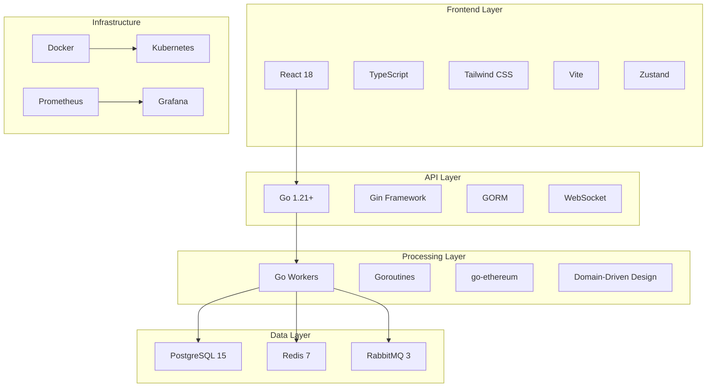

# 🛠️ Stack Tecnológico do BesuScan

## 📋 Visão Geral

O BesuScan foi construído utilizando tecnologias modernas e robustas, escolhidas criteriosamente para atender aos requisitos de performance, escalabilidade e manutenibilidade de um block explorer enterprise.

## 🏗️ Arquitetura Tecnológica



## 🔧 Backend Technologies

### **Go (Golang) 1.21+**

**Por que Go?**
- **Performance**: Compilado, garbage collector otimizado
- **Concorrência**: Goroutines nativas para processamento paralelo
- **Simplicidade**: Sintaxe clara e manutenível
- **Ecosystem**: Excelente suporte para blockchain e APIs

**Bibliotecas Principais**:
```go
// Blockchain interaction
github.com/ethereum/go-ethereum v1.13.5

// Web framework
github.com/gin-gonic/gin v1.9.1

// Database ORM
gorm.io/gorm v1.25.5
gorm.io/driver/postgres v1.5.4

// Message queue
github.com/streadway/amqp v1.1.0

// Redis client
github.com/go-redis/redis/v8 v8.11.5

// Configuration
github.com/spf13/viper v1.17.0

// CLI framework (BesuCLI)
github.com/spf13/cobra v1.8.0

// Testing
github.com/stretchr/testify v1.8.4
```

**Estrutura de Projeto**:
```
internal/
├── domain/          # Entidades e interfaces
├── application/     # Use cases e services
├── infrastructure/  # Implementações concretas
└── interfaces/      # Controllers e handlers
```

### **Gin Web Framework**

**Características**:
- **Performance**: Um dos frameworks Go mais rápidos
- **Middleware**: Sistema extensível de middlewares
- **JSON Binding**: Serialização/deserialização automática
- **Routing**: Sistema de rotas flexível

**Exemplo de Uso**:
```go
func SetupRouter() *gin.Engine {
    r := gin.Default()

    // Middleware
    r.Use(gin.Logger())
    r.Use(gin.Recovery())
    r.Use(cors.Default())

    // Routes
    api := r.Group("/api")
    {
        api.GET("/blocks", blockHandler.GetBlocks)
        api.GET("/blocks/:id", blockHandler.GetBlock)
        api.GET("/transactions/:hash", txHandler.GetTransaction)
    }

    return r
}
```

### **GORM - Object Relational Mapping**

**Benefícios**:
- **Type Safety**: Queries type-safe
- **Auto Migration**: Schema automático
- **Associations**: Relacionamentos complexos
- **Performance**: Query optimization

**Exemplo de Modelo**:
```go
type Block struct {
    Hash         string    `gorm:"primaryKey;size:66"`
    Number       uint64    `gorm:"uniqueIndex;not null"`
    Timestamp    time.Time `gorm:"not null"`
    Miner        string    `gorm:"size:42"`
    GasUsed      uint64    `gorm:"default:0"`
    GasLimit     uint64    `gorm:"default:0"`
    TxCount      int       `gorm:"default:0"`
    Transactions []Transaction `gorm:"foreignKey:BlockHash;references:Hash"`
}
```

## 🌐 Frontend Technologies

### **React 18**

**Por que React?**
- **Component-Based**: Arquitetura modular e reutilizável
- **Virtual DOM**: Performance otimizada
- **Hooks**: Estado e efeitos modernos
- **Ecosystem**: Vasto ecossistema de bibliotecas

**Hooks Utilizados**:
```typescript
// State management
const [blocks, setBlocks] = useState<Block[]>([]);

// Side effects
useEffect(() => {
    fetchLatestBlocks();
}, []);

// Memoization
const expensiveCalculation = useMemo(() => {
    return calculateNetworkStats(blocks);
}, [blocks]);

// Callbacks
const handleBlockClick = useCallback((blockHash: string) => {
    navigate(`/block/${blockHash}`);
}, [navigate]);
```

### **TypeScript**

**Benefícios**:
- **Type Safety**: Detecção de erros em tempo de compilação
- **IntelliSense**: Autocompletar avançado
- **Refactoring**: Refatoração segura
- **Documentation**: Tipos servem como documentação

**Definições de Tipos**:
```typescript
interface Block {
    hash: string;
    number: number;
    timestamp: string;
    miner: string;
    gasUsed: number;
    gasLimit: number;
    txCount: number;
    transactions?: Transaction[];
}

interface ApiResponse<T> {
    success: boolean;
    data: T;
    error?: string;
}
```

### **Tailwind CSS**

**Por que Tailwind?**
- **Utility-First**: Classes utilitárias composáveis
- **Customização**: Sistema de design flexível
- **Performance**: CSS otimizado e minificado
- **Consistency**: Design system consistente

**Exemplo de Componente**:
```tsx
const BlockCard = ({ block }: { block: Block }) => (
    <div className="bg-white dark:bg-gray-800 rounded-lg shadow-md p-6 hover:shadow-lg transition-shadow">
        <div className="flex items-center justify-between mb-4">
            <h3 className="text-lg font-semibold text-gray-900 dark:text-white">
                Block #{block.number}
            </h3>
            <span className="text-sm text-gray-500 dark:text-gray-400">
                {formatTimestamp(block.timestamp)}
            </span>
        </div>
        <div className="grid grid-cols-2 gap-4 text-sm">
            <div>
                <span className="text-gray-500 dark:text-gray-400">Gas Used:</span>
                <span className="ml-2 font-medium">{block.gasUsed.toLocaleString()}</span>
            </div>
            <div>
                <span className="text-gray-500 dark:text-gray-400">Transactions:</span>
                <span className="ml-2 font-medium">{block.txCount}</span>
            </div>
        </div>
    </div>
);
```

### **Vite Build Tool**

**Vantagens**:
- **Dev Server**: Hot Module Replacement ultra-rápido
- **Build**: Otimizações automáticas de produção
- **Plugins**: Sistema extensível de plugins
- **Modern**: Suporte nativo para ES modules

**Configuração**:
```typescript
export default defineConfig({
    plugins: [react()],
    server: {
        host: '0.0.0.0',
        port: 3000,
    },
    build: {
        outDir: 'dist',
        sourcemap: true,
    },
    resolve: {
        alias: {
            '@': path.resolve(__dirname, './src'),
        },
    },
});
```

### **Zustand - State Management**

**Por que Zustand?**
- **Simplicidade**: API minimalista e intuitiva
- **Performance**: Re-renders otimizados
- **TypeScript**: Excelente suporte a tipos
- **Flexibilidade**: Sem boilerplate desnecessário

**Store Example**:
```typescript
interface AppState {
    blocks: Block[];
    loading: boolean;
    fetchBlocks: () => Promise<void>;
    setBlocks: (blocks: Block[]) => void;
}

const useAppStore = create<AppState>((set, get) => ({
    blocks: [],
    loading: false,

    fetchBlocks: async () => {
        set({ loading: true });
        try {
            const response = await api.getBlocks();
            set({ blocks: response.data, loading: false });
        } catch (error) {
            set({ loading: false });
            console.error('Error fetching blocks:', error);
        }
    },

    setBlocks: (blocks) => set({ blocks }),
}));
```

## 🗄️ Data Technologies

### **PostgreSQL 15**

**Por que PostgreSQL?**
- **ACID Compliance**: Transações seguras e consistentes
- **JSON Support**: Suporte nativo para dados JSON
- **Indexing**: Sistema avançado de índices
- **Extensibility**: Extensões para funcionalidades específicas

**Configurações Otimizadas**:
```sql
-- postgresql.conf optimizations
shared_buffers = '256MB'
effective_cache_size = '1GB'
maintenance_work_mem = '64MB'
checkpoint_completion_target = 0.9
wal_buffers = '16MB'
default_statistics_target = 100
random_page_cost = 1.1
effective_io_concurrency = 200
```

**Extensões Utilizadas**:
```sql
-- Estatísticas de queries
CREATE EXTENSION IF NOT EXISTS pg_stat_statements;

-- Funções de hash
CREATE EXTENSION IF NOT EXISTS pgcrypto;

-- Full-text search
CREATE EXTENSION IF NOT EXISTS pg_trgm;
```

### **Redis 7**

**Casos de Uso**:
- **Cache**: Dados frequentemente acessados
- **Session Storage**: Sessões de usuário
- **Rate Limiting**: Controle de taxa de requests
- **Real-time Data**: Dados em tempo real

**Configuração Otimizada**:
```redis
# redis.conf
maxmemory 512mb
maxmemory-policy allkeys-lru
save 900 1
save 300 10
save 60 10000
appendonly yes
appendfsync everysec
```

**Estruturas de Dados**:
```go
// Cache de bloco
type CachedBlock struct {
    Number    int64  `json:"number"`
    Hash      string `json:"hash"`
    Timestamp int64  `json:"timestamp"`
    TxCount   int    `json:"tx_count"`
}

// Configurar cache
func (c *Cache) SetBlock(blockNumber int64, block CachedBlock) error {
    key := fmt.Sprintf("block:%d", blockNumber)
    data, _ := json.Marshal(block)
    return c.client.Set(ctx, key, data, 30*time.Minute).Err()
}
```

### **RabbitMQ 3**

**Padrões de Mensageria**:
- **Work Queues**: Distribuição de trabalho
- **Publish/Subscribe**: Broadcast de eventos
- **Routing**: Roteamento baseado em critérios
- **Topics**: Roteamento por padrões

**Configuração de Filas**:
```go
// Declaração de filas
func DeclareQueues(ch *amqp.Channel) error {
    queues := []Queue{
        {Name: "blocks.new", Durable: true, AutoDelete: false},
        {Name: "transactions.new", Durable: true, AutoDelete: false},
        {Name: "events.new", Durable: true, AutoDelete: false},
    }

    for _, queue := range queues {
        _, err := ch.QueueDeclare(
            queue.Name,
            queue.Durable,
            queue.AutoDelete,
            false, // exclusive
            false, // no-wait
            nil,   // arguments
        )
        if err != nil {
            return err
        }
    }

    return nil
}
```

## 🔧 CLI Technologies

### **Cobra CLI Framework**

**Características**:
- **Command Structure**: Comandos hierárquicos
- **Flag Parsing**: Parsing automático de flags
- **Help Generation**: Help automático
- **Shell Completion**: Autocompletar para shells

**Estrutura de Comandos**:
```go
var rootCmd = &cobra.Command{
    Use:   "besucli",
    Short: "BesuScan CLI for smart contract management",
    Long:  `A powerful CLI tool for deploying and managing smart contracts on Hyperledger Besu`,
}

var deployCmd = &cobra.Command{
    Use:   "deploy [yaml-file]",
    Short: "Deploy smart contracts",
    Args:  cobra.ExactArgs(1),
    RunE:  runDeploy,
}

func init() {
    rootCmd.AddCommand(deployCmd)
    deployCmd.Flags().StringP("network", "n", "", "Network to deploy to")
    deployCmd.Flags().BoolP("verify", "v", false, "Auto-verify contract")
}
```

## 🏗️ Infrastructure Technologies

### **Docker & Docker Compose**

**Benefícios**:
- **Consistency**: Ambiente consistente entre dev/prod
- **Isolation**: Isolamento de dependências
- **Scalability**: Fácil escalabilidade horizontal
- **Portability**: Portabilidade entre ambientes

**Multi-stage Dockerfile**:
```dockerfile
# Build stage
FROM golang:1.21-alpine AS builder
WORKDIR /app
COPY go.mod go.sum ./
RUN go mod download
COPY . .
RUN CGO_ENABLED=0 GOOS=linux go build -o main ./cmd

# Production stage
FROM alpine:latest
RUN apk --no-cache add ca-certificates
WORKDIR /root/
COPY --from=builder /app/main .
CMD ["./main"]
```

### **Kubernetes**

**Recursos Utilizados**:
- **Deployments**: Gerenciamento de pods
- **Services**: Load balancing interno
- **ConfigMaps**: Configurações
- **Secrets**: Dados sensíveis
- **Ingress**: Roteamento de tráfego

**Exemplo de Deployment**:
```yaml
apiVersion: apps/v1
kind: Deployment
metadata:
  name: besuscan-api
spec:
  replicas: 3
  selector:
    matchLabels:
      app: besuscan-api
  template:
    metadata:
      labels:
        app: besuscan-api
    spec:
      containers:
      - name: api
        image: besuscan/api:latest
        ports:
        - containerPort: 8080
        env:
        - name: DATABASE_URL
          valueFrom:
            secretKeyRef:
              name: db-secret
              key: url
```

## 📊 Monitoring Technologies

### **Prometheus + Grafana**

**Métricas Coletadas**:
```go
var (
    requestsTotal = prometheus.NewCounterVec(
        prometheus.CounterOpts{
            Name: "http_requests_total",
            Help: "Total number of HTTP requests",
        },
        []string{"method", "endpoint", "status"},
    )

    requestDuration = prometheus.NewHistogramVec(
        prometheus.HistogramOpts{
            Name: "http_request_duration_seconds",
            Help: "HTTP request duration in seconds",
        },
        []string{"method", "endpoint"},
    )
)
```

**Dashboard Configuration**:
```json
{
  "dashboard": {
    "title": "BesuScan API Metrics",
    "panels": [
      {
        "title": "Request Rate",
        "type": "graph",
        "targets": [
          {
            "expr": "rate(http_requests_total[5m])",
            "legendFormat": "{{method}} {{endpoint}}"
          }
        ]
      }
    ]
  }
}
```

## 🧪 Testing Technologies

### **Backend Testing**
```go
// Unit tests with testify
func TestBlockService_GetLatestBlock(t *testing.T) {
    // Arrange
    mockRepo := &mocks.BlockRepository{}
    service := NewBlockService(mockRepo)
    expectedBlock := &entities.Block{Hash: "0x123", Number: 100}
    mockRepo.On("GetLatest", mock.Anything).Return(expectedBlock, nil)

    // Act
    result, err := service.GetLatestBlock(context.Background())

    // Assert
    assert.NoError(t, err)
    assert.Equal(t, expectedBlock, result)
    mockRepo.AssertExpectations(t)
}
```

### **Frontend Testing**
```typescript
// Component tests with React Testing Library
import { render, screen } from '@testing-library/react';
import { BlockCard } from './BlockCard';

test('renders block information correctly', () => {
    const mockBlock = {
        hash: '0x123',
        number: 100,
        timestamp: '2024-01-01T00:00:00Z',
        gasUsed: 21000,
        txCount: 1
    };

    render(<BlockCard block={mockBlock} />);

    expect(screen.getByText('Block #100')).toBeInTheDocument();
    expect(screen.getByText('21,000')).toBeInTheDocument();
});
```

## 🔒 Security Technologies

### **JWT Authentication**
```go
func GenerateJWT(userID string) (string, error) {
    token := jwt.NewWithClaims(jwt.SigningMethodHS256, jwt.MapClaims{
        "user_id": userID,
        "exp":     time.Now().Add(time.Hour * 24).Unix(),
    })

    return token.SignedString([]byte(jwtSecret))
}
```

### **Rate Limiting**
```go
func RateLimitMiddleware() gin.HandlerFunc {
    limiter := rate.NewLimiter(rate.Every(time.Minute), 100)

    return func(c *gin.Context) {
        if !limiter.Allow() {
            c.JSON(http.StatusTooManyRequests, gin.H{
                "error": "Rate limit exceeded",
            })
            c.Abort()
            return
        }
        c.Next()
    }
}
```

## 📈 Performance Benchmarks

### **Backend Performance**
- **API Response Time**: < 50ms (95th percentile)
- **Database Query Time**: < 10ms (average)
- **Memory Usage**: < 512MB per service
- **CPU Usage**: < 50% under normal load

### **Frontend Performance**
- **First Contentful Paint**: < 1.5s
- **Largest Contentful Paint**: < 2.5s
- **Time to Interactive**: < 3.5s
- **Bundle Size**: < 500KB gzipped

### **Infrastructure Performance**
- **Container Startup**: < 30s
- **Database Connection Pool**: 100 connections
- **Cache Hit Rate**: > 90%
- **Message Queue Throughput**: 10k+ messages/second

## 🎯 Technology Decision Matrix

| Requirement | Technology | Alternative | Justification |
|-------------|------------|-------------|---------------|
| **Backend Language** | Go | Rust, Node.js | Performance + Ecosystem |
| **Web Framework** | Gin | Echo, Fiber | Simplicity + Speed |
| **Database** | PostgreSQL | MySQL, MongoDB | ACID + JSON Support |
| **Cache** | Redis | Memcached | Data Structures |
| **Message Queue** | RabbitMQ | Apache Kafka | Ease of Use |
| **Frontend** | React | Vue, Angular | Ecosystem + Team |
| **Styling** | Tailwind | Styled Components | Utility-first |
| **Build Tool** | Vite | Webpack | Speed + DX |
| **Container** | Docker | Podman | Standard |
| **Orchestration** | Kubernetes | Docker Swarm | Features + Community |

---

[⬅️ Voltar: Fluxo de Dados](./02-fluxo-dados.md) | [➡️ Próximo: Indexer](./04-indexer.md)
