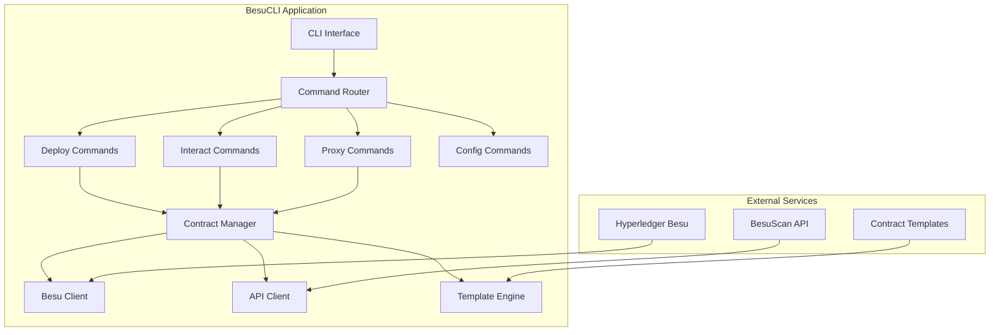

# 🛠️ BesuCLI - Ferramenta de Linha de Comando

## 📋 Visão Geral

O **BesuCLI** é uma ferramenta de linha de comando moderna e poderosa para deploy, verificação e gerenciamento de smart contracts na rede Hyperledger Besu. Ele oferece uma interface intuitiva e recursos avançados para desenvolvedores e operadores de blockchain.

## ✨ Características Principais

### 🚀 **Deploy Automatizado**
- Deploy via arquivos YAML (recomendado)
- Deploy tradicional via flags
- Verificação automática de contratos
- Templates pré-configurados
- Suporte para múltiplos tipos de contrato

### 🔧 **Gestão de Contratos**
- Verificação de contratos existentes
- Interação com funções (read/write)
- Importação de contratos deployados
- Exportação de dados de contratos
- Sistema de busca avançada

### 🔄 **Proxy Management**
- Suporte completo para UUPS Proxy
- Transparent Proxy support
- Beacon Proxy management
- Upgrade de implementações
- Administração de ownership

### 🎨 **Interface Moderna**
- CLI interativo e colorido
- Progress bars e indicadores
- Validação em tempo real
- Help contextual
- Configuração flexível

## 🏗️ Arquitetura



## 📦 Funcionalidades Principais

### 1. **Deploy de Contratos**

#### **Deploy via YAML (Recomendado)**
```yaml
# token.yml
contract:
  name: "TestCoin"
  symbol: "TEST"
  description: "Token de teste com informações completas"
  type: "ERC-20"

files:
  abi: "templates/abis/ERC20.abi"
  bytecode: "templates/abis/ERC20.bin"

constructor_args:
  - "TestCoin"    # name
  - "TEST"        # symbol
  - "18"          # decimals
  - "2000000"     # initial supply

compiler:
  version: "v0.8.19"
  optimization_enabled: true
  optimization_runs: 200

metadata:
  license: "MIT"
  website_url: ""
  github_url: ""
  tags:
    - "erc20"
    - "test"

deploy:
  auto_verify: true
  save_deployment: true

gas:
  limit: 6000000
  price: "0"
```

**Comando de Deploy**:
```bash
# Deploy usando arquivo YAML
besucli deploy token.yml

# Deploy com configuração customizada
besucli deploy token.yml --network mainnet --gas-price 20000000000
```

#### **Deploy Tradicional via Flags**
```bash
besucli deploy \
  --name "TestCoin" \
  --symbol "TEST" \
  --description "Token de teste" \
  --type "ERC-20" \
  --contract templates/ERC20.sol \
  --abi templates/ERC20.abi \
  --bytecode templates/ERC20.bin \
  --args "TestCoin" \
  --args "TEST" \
  --args "18" \
  --args "2000000" \
  --tags "erc20,test" \
  --license "MIT" \
  --auto-verify
```

### 2. **Verificação de Contratos**

```bash
# Verificar contrato existente
besucli verify 0x1234567890abcdef... \
  --source MyToken.sol \
  --abi MyToken.abi \
  --constructor-args "TestCoin,TEST,18,1000000"

# Verificação automática durante deploy
besucli deploy token.yml --auto-verify
```

### 3. **Interação com Contratos**

#### **Funções Read (Consulta)**
```bash
# Listar todas as funções disponíveis
besucli interact 0x1234... --functions

# Chamar função read
besucli interact 0x1234... --read balanceOf 0x5678...
besucli interact 0x1234... --read totalSupply
besucli interact 0x1234... --read name
```

#### **Funções Write (Transação)**
```bash
# Transfer tokens
besucli interact 0x1234... --write transfer 0x5678... 1000000000000000000

# Approve spending
besucli interact 0x1234... --write approve 0x5678... 500000000000000000

# Mint tokens (se owner)
besucli interact 0x1234... --write mint 0x5678... 1000000000000000000
```

### 4. **Gestão de Proxies**

#### **Deploy de Proxy UUPS**
```yaml
# uups-proxy.yml
proxy:
  type: "UUPS"
  implementation: "0x1234567890abcdef..."
  owner: "0xabcdef1234567890..."

contract:
  name: "MyTokenProxy"
  description: "Proxy for MyToken contract"

deploy:
  auto_verify: true
```

```bash
# Deploy via YAML
besucli proxy deploy uups-proxy.yml

# Deploy via flags
besucli proxy deploy \
  --implementation 0x1234... \
  --type UUPS \
  --owner 0x5678...
```

#### **Upgrade de Proxy**
```bash
# Upgrade para nova implementação
besucli proxy upgrade 0x1234... 0x5678... \
  --reason "Bug fix and new features"

# Verificar implementação atual
besucli proxy info 0x1234...
```

#### **Administração de Proxy**
```bash
# Transferir ownership (UUPS)
besucli proxy admin transfer-ownership 0x1234... 0x5678...

# Alterar admin (Transparent Proxy)
besucli proxy admin change-admin 0x1234... 0x5678...

# Renunciar ownership
besucli proxy admin renounce-ownership 0x1234...
```

### 5. **Importação de Contratos**

```yaml
# contract-import.yml
import:
  address: "0x1234567890abcdef..."
  name: "ExistingToken"
  symbol: "EXIST"
  type: "ERC-20"

verification:
  source_code: "ExistingToken.sol"
  abi_file: "ExistingToken.abi"
  auto_verify: true

metadata:
  description: "Imported existing token contract"
  tags: ["imported", "erc20"]
```

```bash
# Importar via YAML
besucli import contract-import.yml

# Importar via flags
besucli import \
  --address 0x1234... \
  --name "ExistingToken" \
  --type "ERC-20" \
  --auto-verify
```

### 6. **Gestão de Contratos**

```bash
# Listar todos os contratos
besucli contracts list

# Buscar contratos
besucli contracts search "token" --type "ERC-20" --verified

# Informações detalhadas
besucli contracts info 0x1234...

# Exportar dados
besucli contracts export 0x1234... \
  --format json \
  --include-abi \
  --include-source
```

## 🎯 Templates Disponíveis

### **ERC-20 Token**
```bash
# Deploy básico ERC-20
besucli deploy templates/erc20.yml

# Customizar parâmetros
besucli deploy templates/erc20.yml \
  --set name="MyToken" \
  --set symbol="MTK" \
  --set supply="1000000"
```

### **ERC-721 NFT**
```bash
# Deploy NFT collection
besucli deploy templates/erc721.yml

# NFT com metadata URI
besucli deploy templates/erc721.yml \
  --set baseURI="https://api.mynft.com/metadata/"
```

### **ERC-1155 Multi-Token**
```bash
# Deploy multi-token contract
besucli deploy templates/erc1155.yml
```

### **Account Abstraction (ERC-4337)**
```bash
# Deploy Smart Account Factory
besucli deploy templates/aa-factory.yml

# Deploy Smart Account
besucli deploy templates/aa-account.yml \
  --set owner="0x1234567890abcdef..."
```

### **Custom Contracts**
```bash
# Counter example
besucli deploy templates/counter.yml

# Voting contract
besucli deploy templates/voting.yml

# Multisig wallet
besucli deploy templates/multisig.yml
```

## ⚙️ Configuração

### **Arquivo de Configuração**
```yaml
# ~/.besucli.yaml
network:
  rpc_url: "http://localhost:8545"
  name: "besu-local"
  chain_id: 1337

api:
  base_url: "http://localhost:8080/api"
  timeout: 30s

wallet:
  private_key: "0x..." # ou usar keystore
  keystore_path: "./keystore"

gas:
  limit: 6000000
  price: "20000000000"
  multiplier: 1.1

compiler:
  solc_version: "0.8.19"
  optimizer_enabled: true
  optimizer_runs: 200

templates:
  path: "./templates"
  auto_update: true

logging:
  level: "info"
  format: "text"
  file: "./besucli.log"
```

### **Variáveis de Ambiente**
```bash
# Network configuration
BESU_RPC_URL=http://localhost:8545
BESU_WS_URL=ws://localhost:8546
CHAIN_ID=1337

# API configuration
BESUSCAN_API_URL=http://localhost:8080/api
API_TIMEOUT=30s

# Wallet configuration
PRIVATE_KEY=0x...
KEYSTORE_PATH=./keystore
WALLET_PASSWORD=

# Gas configuration
GAS_LIMIT=6000000
GAS_PRICE=20000000000
GAS_MULTIPLIER=1.1

# Compiler configuration
SOLC_VERSION=0.8.19
OPTIMIZER_ENABLED=true
OPTIMIZER_RUNS=200
```

### **Comandos de Configuração**
```bash
# Configurar wallet
besucli config set-wallet

# Configurar rede
besucli config set-network

# Mostrar configuração atual
besucli config show

# Testar conectividade
besucli config test
```

## 🔧 Instalação e Setup

### **Instalação via Binary**
```bash
# Download da release
curl -L https://github.com/hubweb3/besucli/releases/latest/download/besucli-linux-amd64 -o besucli
chmod +x besucli
sudo mv besucli /usr/local/bin/

# Verificar instalação
besucli --version
```

### **Instalação via Go**
```bash
# Instalar via go install
go install github.com/hubweb3/besucli@latest

# Ou build local
git clone https://github.com/hubweb3/besucli.git
cd besucli
make install
```

### **Instalação via Docker**
```bash
# Executar via Docker
docker run --rm -v $(pwd):/workspace hubweb3/besucli:latest deploy token.yml

# Alias para facilitar uso
alias besucli='docker run --rm -v $(pwd):/workspace hubweb3/besucli:latest'
```

### **Setup Inicial**
```bash
# Setup completo automatizado
make setup

# Ou passo a passo
besucli config init
besucli config set-wallet
besucli config set-network
besucli config test
```

## 📊 Monitoramento e Logs

### **Logs Estruturados**
```bash
# Logs detalhados
besucli deploy token.yml --verbose

# Logs em JSON
besucli deploy token.yml --log-format json

# Salvar logs em arquivo
besucli deploy token.yml --log-file deployment.log
```

### **Métricas**
- Tempo de deploy
- Gas usado
- Taxa de sucesso
- Contratos verificados
- Transações enviadas

### **Progress Indicators**
```
🚀 Deploying contract...
[████████████████████████████████] 100% | ETA: 0s | 4/4 steps

✅ Contract deployed successfully!
   Address: 0x1234567890abcdef...
   Transaction: 0xabcdef1234567890...
   Gas Used: 1,234,567

🔍 Verifying contract...
[████████████████████████████████] 100% | ETA: 0s | Verification complete

✅ Contract verified on BesuScan!
   View at: https://besuscan.com/address/0x1234567890abcdef...
```

## 🔒 Segurança

### **Wallet Management**
```bash
# Usar keystore (recomendado)
besucli config set-wallet --keystore

# Usar hardware wallet
besucli config set-wallet --hardware

# Usar private key (desenvolvimento apenas)
besucli config set-wallet --private-key
```

### **Validações**
- Verificação de saldo antes de deploy
- Validação de bytecode
- Checagem de gas limit
- Confirmação de transações críticas

### **Audit Trail**
- Log de todas as operações
- Hash de transações
- Timestamps precisos
- Backup de configurações

## 🐛 Troubleshooting

### **Problemas Comuns**

1. **Deploy falha por gas insuficiente**
```bash
# Verificar saldo
besucli wallet balance

# Aumentar gas limit
besucli deploy token.yml --gas-limit 8000000
```

2. **Verificação falha**
```bash
# Verificar manualmente
besucli verify 0x1234... --source MyToken.sol --debug

# Recompilar com mesmas configurações
besucli compile MyToken.sol --optimizer --runs 200
```

3. **Conexão com Besu falha**
```bash
# Testar conectividade
besucli config test

# Usar RPC alternativo
besucli deploy token.yml --rpc-url http://backup-node:8545
```

### **Debug Mode**
```bash
# Ativar debug completo
besucli deploy token.yml --debug

# Dry run (simular sem executar)
besucli deploy token.yml --dry-run

# Verbose output
besucli deploy token.yml --verbose
```

## 📈 Roadmap

### **Próximas Features**
- [ ] Suporte para Foundry
- [ ] Hardhat integration
- [ ] Multi-sig deployment
- [ ] Batch operations
- [ ] Advanced templates
- [ ] Plugin system

### **Melhorias Planejadas**
- [ ] GUI web interface
- [ ] Mobile app
- [ ] VS Code extension
- [ ] Advanced analytics
- [ ] Team collaboration
- [ ] Enterprise features

## 📚 Exemplos Práticos

### **Deploy Completo ERC-20**
```bash
# 1. Compilar contrato
solc --bin --abi MyToken.sol -o ./build/

# 2. Criar arquivo de configuração
cat > mytoken.yml << EOF
contract:
  name: "MyAwesomeToken"
  symbol: "MAT"
  type: "ERC-20"
files:
  abi: "./build/MyToken.abi"
  bytecode: "./build/MyToken.bin"
constructor_args:
  - "MyAwesomeToken"
  - "MAT"
  - "18"
  - "1000000000000000000000000"
deploy:
  auto_verify: true
EOF

# 3. Deploy
besucli deploy mytoken.yml

# 4. Verificar deploy
besucli contracts info 0x...

# 5. Interagir
besucli interact 0x... --read totalSupply
```

### **Gestão de Proxy UUPS**
```bash
# 1. Deploy implementação
besucli deploy implementation.yml

# 2. Deploy proxy
besucli proxy deploy --implementation 0x... --type UUPS

# 3. Upgrade
besucli proxy upgrade 0xproxy... 0xnewimpl... --reason "Add new features"

# 4. Verificar
besucli proxy info 0xproxy...
```

---

[⬅️ Voltar: Frontend](./07-frontend.md) | [➡️ Próximo: Banco de Dados](./09-database.md)
