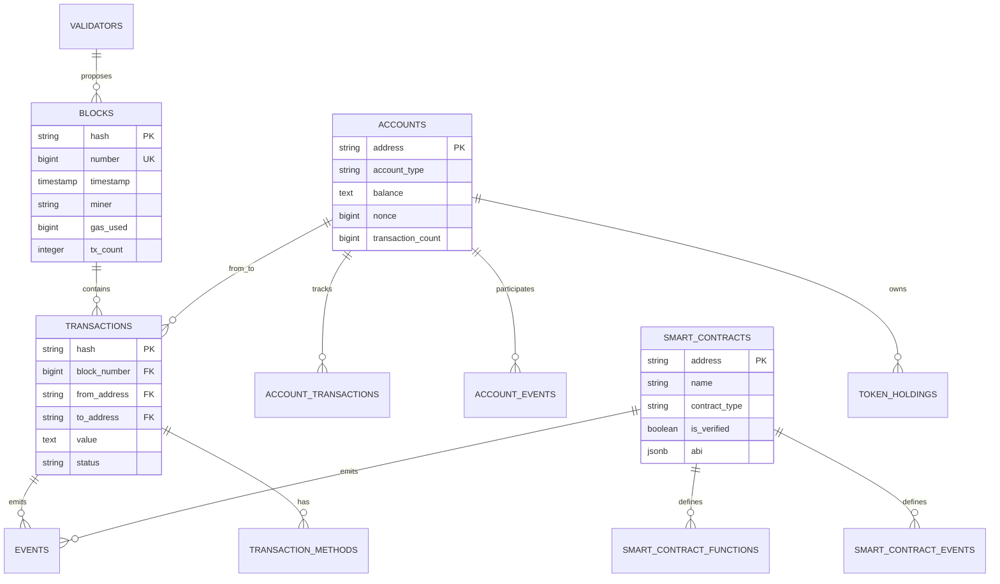

# 🐘 Banco de Dados - Estrutura e DDL

## 📋 Visão Geral

O BesuScan utiliza **PostgreSQL 15** como banco de dados principal, projetado para alta performance, escalabilidade e integridade dos dados da blockchain. A estrutura segue padrões de normalização e otimização específicos para dados de blockchain.

## 🏗️ Arquitetura do Banco

### **Princípios de Design**
- **Normalização**: Redução de redundância e integridade referencial
- **Indexação Otimizada**: Índices específicos para consultas de blockchain
- **Particionamento**: Tabelas grandes particionadas por data/bloco
- **Constraints**: Validações de integridade e consistência
- **Performance**: Otimizações para alta throughput

### **Estratégia de Dados**
- **Hot Data**: Blocos e transações recentes (< 24h)
- **Warm Data**: Dados históricos frequentemente acessados (< 30 dias)
- **Cold Data**: Dados arquivados (> 30 dias)
- **Analytics**: Tabelas agregadas para métricas

## 📊 Diagrama ER Simplificado



## 📋 Tabelas Principais

### 1. **Blocks** - Blocos da Blockchain

```sql
CREATE TABLE public.blocks (
    number int8 NOT NULL,                    -- Número sequencial do bloco
    hash varchar(66) NOT NULL,              -- Hash único do bloco (PK)
    parent_hash varchar(66) NULL,           -- Hash do bloco pai
    timestamp timestamptz NOT NULL,         -- Timestamp do bloco
    miner varchar(42) NULL,                 -- Endereço do minerador
    difficulty text NULL,                   -- Dificuldade de mineração
    total_difficulty text NULL,             -- Dificuldade total acumulada
    size int8 DEFAULT 0 NULL,               -- Tamanho do bloco em bytes
    gas_limit int8 DEFAULT 0 NOT NULL,      -- Limite de gas do bloco
    gas_used int8 DEFAULT 0 NOT NULL,       -- Gas utilizado no bloco
    base_fee_per_gas text NULL,             -- Taxa base por gas (EIP-1559)
    tx_count int4 DEFAULT 0 NOT NULL,       -- Número de transações
    uncle_count int4 DEFAULT 0 NOT NULL,    -- Número de uncle blocks
    bloom text NULL,                        -- Bloom filter do bloco
    extra_data text NULL,                   -- Dados extras do minerador
    mix_digest varchar(66) NULL,            -- Mix digest do consenso
    nonce int8 DEFAULT 0 NULL,              -- Nonce do bloco
    receipt_hash varchar(66) NULL,          -- Hash das receipts
    state_root varchar(66) NULL,            -- Root do estado
    tx_hash varchar(66) NULL,               -- Hash das transações
    created_at timestamptz DEFAULT now() NOT NULL,
    updated_at timestamptz DEFAULT now() NOT NULL,
    deleted_at timestamptz NULL,

    CONSTRAINT blocks_pkey PRIMARY KEY (hash)
);
```

**Índices Otimizados**:
```sql
CREATE UNIQUE INDEX idx_blocks_number ON blocks (number);
CREATE INDEX idx_blocks_timestamp ON blocks (timestamp);
CREATE INDEX idx_blocks_miner ON blocks (miner);
CREATE INDEX idx_blocks_gas_used ON blocks (gas_used);
CREATE INDEX idx_blocks_number_timestamp ON blocks (number DESC, timestamp DESC);
```

### 2. **Transactions** - Transações

```sql
CREATE TABLE public.transactions (
    hash varchar(66) NOT NULL,              -- Hash único da transação (PK)
    block_number int8 NULL,                 -- Número do bloco
    block_hash varchar(66) NULL,            -- Hash do bloco
    transaction_index int8 NULL,            -- Índice na transação
    from_address varchar(42) NOT NULL,      -- Endereço remetente
    to_address varchar(42) NULL,            -- Endereço destinatário
    value text DEFAULT '0' NOT NULL,        -- Valor transferido (wei)
    gas_limit int8 NOT NULL,                -- Limite de gas
    gas_price text NULL,                    -- Preço do gas (legacy)
    gas_used int8 NULL,                     -- Gas utilizado
    max_fee_per_gas text NULL,              -- Taxa máxima (EIP-1559)
    max_priority_fee_per_gas text NULL,     -- Taxa de prioridade (EIP-1559)
    nonce int8 NOT NULL,                    -- Nonce da transação
    data bytea NULL,                        -- Dados de entrada
    transaction_type int2 DEFAULT 0 NOT NULL, -- Tipo (0=Legacy, 1=AccessList, 2=DynamicFee)
    access_list bytea NULL,                 -- Lista de acesso
    status varchar(20) DEFAULT 'pending' NOT NULL, -- Status da transação
    contract_address varchar(42) NULL,      -- Endereço do contrato criado
    logs_bloom bytea NULL,                  -- Bloom filter dos logs
    created_at timestamptz DEFAULT now() NOT NULL,
    updated_at timestamptz DEFAULT now() NOT NULL,
    mined_at timestamptz NULL,              -- Timestamp de mineração
    deleted_at timestamptz NULL,

    CONSTRAINT transactions_pkey PRIMARY KEY (hash),
    CONSTRAINT unique_tx_per_block UNIQUE (block_hash, transaction_index)
);
```

**Índices Estratégicos**:
```sql
CREATE INDEX idx_transactions_from_address ON transactions (from_address);
CREATE INDEX idx_transactions_to_address ON transactions (to_address);
CREATE INDEX idx_transactions_block_number ON transactions (block_number);
CREATE INDEX idx_transactions_status ON transactions (status);
CREATE INDEX idx_transactions_addresses ON transactions USING gin ((ARRAY[from_address, to_address]));
```

### 3. **Accounts** - Contas da Blockchain

```sql
CREATE TABLE public.accounts (
    address varchar(42) NOT NULL,           -- Endereço da conta (PK)
    account_type varchar(20) DEFAULT 'eoa' NOT NULL, -- Tipo: eoa, smart_account
    balance text DEFAULT '0' NOT NULL,      -- Saldo em wei
    nonce int8 DEFAULT 0 NOT NULL,          -- Nonce atual
    transaction_count int8 DEFAULT 0 NOT NULL, -- Número de transações
    contract_interactions int8 DEFAULT 0 NOT NULL, -- Interações com contratos
    smart_contract_deployments int8 DEFAULT 0 NOT NULL, -- Contratos deployados
    first_seen timestamptz DEFAULT now() NOT NULL, -- Primeira atividade
    last_activity timestamptz NULL,         -- Última atividade
    is_contract bool DEFAULT false NOT NULL, -- É um contrato?
    contract_type varchar(50) NULL,         -- Tipo do contrato
    factory_address varchar(42) NULL,       -- Factory (Smart Accounts)
    implementation_address varchar(42) NULL, -- Implementação (Smart Accounts)
    owner_address varchar(42) NULL,         -- Owner (Smart Accounts)
    label varchar(255) NULL,                -- Label personalizado
    risk_score int4 NULL,                   -- Score de risco (0-10)
    compliance_status varchar(20) DEFAULT 'compliant' NOT NULL,
    compliance_notes text NULL,
    created_at timestamptz DEFAULT now() NOT NULL,
    updated_at timestamptz DEFAULT now() NOT NULL,

    CONSTRAINT accounts_pkey PRIMARY KEY (address),
    CONSTRAINT accounts_risk_score_check CHECK ((risk_score >= 0) AND (risk_score <= 10))
);
```

### 4. **Smart_Contracts** - Contratos Inteligentes

```sql
CREATE TABLE public.smart_contracts (
    address varchar(42) NOT NULL,           -- Endereço do contrato (PK)
    name varchar(255) NULL,                 -- Nome do contrato
    symbol varchar(50) NULL,                -- Símbolo (tokens)
    contract_type varchar(50) NULL,         -- Tipo do contrato
    creator_address varchar(42) NOT NULL,   -- Criador do contrato
    creation_tx_hash varchar(66) NOT NULL,  -- Hash da transação de criação
    creation_block_number int8 NOT NULL,    -- Bloco de criação
    creation_timestamp timestamptz NOT NULL,
    is_verified bool DEFAULT false NULL,    -- Contrato verificado?
    verification_date timestamptz NULL,
    compiler_version varchar(50) NULL,      -- Versão do compilador
    optimization_enabled bool NULL,         -- Otimização habilitada?
    optimization_runs int4 NULL,            -- Número de runs de otimização
    license_type varchar(50) NULL,          -- Tipo de licença
    source_code text NULL,                  -- Código fonte
    abi jsonb NULL,                         -- ABI do contrato
    bytecode text NULL,                     -- Bytecode
    constructor_args text NULL,             -- Argumentos do construtor
    balance numeric(78) DEFAULT 0 NULL,     -- Saldo do contrato
    nonce int8 DEFAULT 0 NULL,              -- Nonce
    code_size int4 NULL,                    -- Tamanho do código
    storage_size int4 NULL,                 -- Tamanho do storage
    total_transactions int8 DEFAULT 0 NULL, -- Total de transações
    total_internal_transactions int8 DEFAULT 0 NULL,
    total_events int8 DEFAULT 0 NULL,       -- Total de eventos
    unique_addresses_count int8 DEFAULT 0 NULL, -- Endereços únicos
    total_gas_used numeric(78) DEFAULT 0 NULL, -- Gas total usado
    total_value_transferred numeric(78) DEFAULT 0 NULL, -- Valor total transferido
    first_transaction_at timestamptz NULL,
    last_transaction_at timestamptz NULL,
    last_activity_at timestamptz NULL,
    is_active bool DEFAULT true NULL,
    is_proxy bool DEFAULT false NULL,       -- É um proxy?
    proxy_implementation varchar(42) NULL,  -- Endereço da implementação
    is_token bool DEFAULT false NULL,       -- É um token?
    description text NULL,
    website_url varchar(500) NULL,
    github_url varchar(500) NULL,
    documentation_url varchar(500) NULL,
    tags _text NULL,                        -- Array de tags
    created_at timestamptz DEFAULT now() NOT NULL,
    updated_at timestamptz DEFAULT now() NOT NULL,
    last_metrics_update timestamptz NULL,

    CONSTRAINT smart_contracts_pkey PRIMARY KEY (address)
);
```

### 5. **Events** - Eventos de Contratos

```sql
CREATE TABLE public.events (
    id varchar(255) NOT NULL,               -- ID único do evento
    contract_address varchar(42) NOT NULL,  -- Endereço do contrato
    contract_name varchar(255) NULL,        -- Nome do contrato
    event_name varchar(255) NOT NULL,       -- Nome do evento
    event_signature varchar(66) NOT NULL,   -- Signature do evento
    transaction_hash varchar(66) NOT NULL,  -- Hash da transação
    block_number int8 NOT NULL,             -- Número do bloco
    block_hash varchar(66) NOT NULL,        -- Hash do bloco
    log_index int8 NOT NULL,                -- Índice do log
    transaction_index int8 NOT NULL,        -- Índice da transação
    from_address varchar(42) NOT NULL,      -- Endereço de origem
    to_address varchar(42) NULL,            -- Endereço de destino
    topics jsonb DEFAULT '[]' NOT NULL,     -- Topics do evento
    data bytea NULL,                        -- Dados brutos
    decoded_data jsonb NULL,                -- Dados decodificados
    gas_used int8 DEFAULT 0 NOT NULL,       -- Gas usado
    gas_price varchar(78) DEFAULT '0' NOT NULL, -- Preço do gas
    status varchar(20) DEFAULT 'success' NOT NULL, -- Status
    removed bool DEFAULT false NOT NULL,    -- Evento removido?
    timestamp timestamptz NOT NULL,         -- Timestamp
    created_at timestamptz DEFAULT now() NOT NULL,
    updated_at timestamptz DEFAULT now() NOT NULL,

    CONSTRAINT events_pkey PRIMARY KEY (id)
);
```

**Índices para Performance**:
```sql
CREATE INDEX idx_events_contract_address ON events (contract_address);
CREATE INDEX idx_events_event_name ON events (event_name);
CREATE INDEX idx_events_transaction_hash ON events (transaction_hash);
CREATE INDEX idx_events_block_number ON events (block_number);
CREATE INDEX idx_events_timestamp ON events (timestamp DESC);
CREATE INDEX idx_events_topics_gin ON events USING gin (topics);
CREATE INDEX idx_events_decoded_data_gin ON events USING gin (decoded_data);
```

## 📊 Tabelas de Analytics

### **Account_Analytics** - Métricas por Conta
```sql
CREATE TABLE public.account_analytics (
    address varchar(42) NOT NULL,
    date date NOT NULL,
    transactions_count int8 DEFAULT 0 NOT NULL,
    unique_addresses_count int8 DEFAULT 0 NOT NULL,
    gas_used text DEFAULT '0' NOT NULL,
    value_transferred text DEFAULT '0' NOT NULL,
    avg_gas_per_tx text DEFAULT '0' NOT NULL,
    success_rate numeric(5, 4) DEFAULT 0.0000 NOT NULL,
    contract_calls_count int8 DEFAULT 0 NOT NULL,
    token_transfers_count int8 DEFAULT 0 NOT NULL,
    created_at timestamptz DEFAULT now() NOT NULL,
    updated_at timestamptz DEFAULT now() NOT NULL,

    CONSTRAINT account_analytics_pkey PRIMARY KEY (address, date)
);
```

### **Smart_Contract_Daily_Metrics** - Métricas Diárias de Contratos
```sql
CREATE TABLE public.smart_contract_daily_metrics (
    id serial4 NOT NULL,
    contract_address varchar(42) NOT NULL,
    date date NOT NULL,
    transactions_count int8 DEFAULT 0 NULL,
    unique_addresses_count int8 DEFAULT 0 NULL,
    gas_used numeric(78) DEFAULT 0 NULL,
    value_transferred numeric(78) DEFAULT 0 NULL,
    events_count int8 DEFAULT 0 NULL,
    avg_gas_per_tx numeric(20, 2) NULL,
    success_rate numeric(5, 4) NULL,
    created_at timestamptz DEFAULT now() NOT NULL,

    CONSTRAINT smart_contract_daily_metrics_pkey PRIMARY KEY (id),
    CONSTRAINT smart_contract_daily_metrics_contract_address_date_key UNIQUE (contract_address, date)
);
```

## 🔧 Funções e Triggers

### **Update Timestamp Trigger**
```sql
CREATE OR REPLACE FUNCTION update_updated_at_column()
RETURNS trigger
LANGUAGE plpgsql
AS $function$
BEGIN
    NEW.updated_at = CURRENT_TIMESTAMP;
    RETURN NEW;
END;
$function$;

-- Aplicar em tabelas relevantes
CREATE TRIGGER update_users_updated_at
    BEFORE UPDATE ON users
    FOR EACH ROW EXECUTE FUNCTION update_updated_at_column();
```

### **Função de Estatísticas**
```sql
CREATE OR REPLACE FUNCTION get_network_stats()
RETURNS TABLE(
    total_blocks bigint,
    total_transactions bigint,
    total_addresses bigint,
    total_contracts bigint,
    avg_block_time numeric
) AS $$
BEGIN
    RETURN QUERY
    SELECT
        (SELECT COUNT(*) FROM blocks) as total_blocks,
        (SELECT COUNT(*) FROM transactions WHERE status = 'success') as total_transactions,
        (SELECT COUNT(*) FROM accounts) as total_addresses,
        (SELECT COUNT(*) FROM smart_contracts) as total_contracts,
        (SELECT AVG(EXTRACT(EPOCH FROM (timestamp - LAG(timestamp) OVER (ORDER BY number))))
         FROM blocks WHERE number > 0 LIMIT 1000) as avg_block_time;
END;
$$ LANGUAGE plpgsql;
```

## 🚀 Otimizações de Performance

### **Particionamento de Tabelas**
```sql
-- Particionar eventos por data
CREATE TABLE events_2024_01 PARTITION OF events
    FOR VALUES FROM ('2024-01-01') TO ('2024-02-01');

CREATE TABLE events_2024_02 PARTITION OF events
    FOR VALUES FROM ('2024-02-01') TO ('2024-03-01');
```

### **Índices Parciais**
```sql
-- Índice apenas para transações bem-sucedidas
CREATE INDEX idx_transactions_success
    ON transactions (block_number, transaction_index)
    WHERE status = 'success';

-- Índice para contas ativas
CREATE INDEX idx_accounts_active
    ON accounts (last_activity)
    WHERE last_activity > NOW() - INTERVAL '30 days';
```

### **Índices Compostos**
```sql
-- Para consultas de histórico de conta
CREATE INDEX idx_account_transactions_composite
    ON account_transactions (account_address, timestamp DESC);

-- Para busca de eventos por contrato e tipo
CREATE INDEX idx_events_contract_name_block
    ON events (contract_address, event_name, block_number DESC);
```

## 📊 Views Materialized

### **Latest Blocks View**
```sql
CREATE MATERIALIZED VIEW mv_latest_blocks AS
SELECT
    number,
    hash,
    timestamp,
    miner,
    tx_count,
    gas_used,
    size
FROM blocks
ORDER BY number DESC
LIMIT 50;

-- Refresh automático
CREATE INDEX ON mv_latest_blocks (number DESC);
```

### **Network Statistics View**
```sql
CREATE MATERIALIZED VIEW mv_network_stats AS
SELECT
    COUNT(*) as total_blocks,
    MAX(number) as latest_block,
    AVG(gas_used) as avg_gas_used,
    AVG(tx_count) as avg_tx_per_block,
    COUNT(DISTINCT miner) as unique_validators
FROM blocks
WHERE timestamp > NOW() - INTERVAL '24 hours';
```

## 🔒 Segurança e Permissões

### **Usuário da Aplicação**
```sql
-- Criar usuário específico para a aplicação
CREATE USER explorer WITH PASSWORD 'secure_password';

-- Conceder permissões necessárias
GRANT CONNECT ON DATABASE blockexplorer TO explorer;
GRANT USAGE ON SCHEMA public TO explorer;
GRANT SELECT, INSERT, UPDATE, DELETE ON ALL TABLES IN SCHEMA public TO explorer;
GRANT USAGE, SELECT ON ALL SEQUENCES IN SCHEMA public TO explorer;
```

### **Row Level Security (RLS)**
```sql
-- Ativar RLS em tabelas sensíveis
ALTER TABLE user_sessions ENABLE ROW LEVEL SECURITY;

-- Política para usuários verem apenas suas próprias sessões
CREATE POLICY user_sessions_policy ON user_sessions
    FOR ALL TO app_user
    USING (user_id = current_setting('app.current_user_id')::integer);
```

## 📈 Monitoramento e Manutenção

### **Queries de Monitoramento**
```sql
-- Tamanho das tabelas
SELECT
    schemaname,
    tablename,
    pg_size_pretty(pg_total_relation_size(schemaname||'.'||tablename)) as size
FROM pg_tables
WHERE schemaname = 'public'
ORDER BY pg_total_relation_size(schemaname||'.'||tablename) DESC;

-- Índices não utilizados
SELECT
    schemaname,
    tablename,
    indexname,
    idx_tup_read,
    idx_tup_fetch
FROM pg_stat_user_indexes
WHERE idx_tup_read = 0 AND idx_tup_fetch = 0;

-- Queries lentas
SELECT
    query,
    calls,
    total_time,
    mean_time,
    rows
FROM pg_stat_statements
ORDER BY mean_time DESC
LIMIT 10;
```

### **Manutenção Automática**
```sql
-- Vacuum automático configurado
ALTER TABLE blocks SET (autovacuum_vacuum_scale_factor = 0.1);
ALTER TABLE transactions SET (autovacuum_vacuum_scale_factor = 0.1);

-- Analyze automático
ALTER TABLE events SET (autovacuum_analyze_scale_factor = 0.05);
```

## 🔄 Backup e Recuperação

### **Backup Incremental**
```bash
#!/bin/bash
# Script de backup incremental
pg_basebackup -h localhost -D /backup/base -U explorer -v -P -W

# Backup lógico de tabelas críticas
pg_dump -h localhost -U explorer -t blocks -t transactions blockexplorer > critical_tables.sql
```

### **Point-in-Time Recovery**
```sql
-- Configurar WAL archiving
archive_mode = on
archive_command = 'cp %p /backup/wal/%f'
wal_level = replica
max_wal_senders = 3
```

## 📋 Scripts de Migração

### **Versionamento de Schema**
```sql
-- Tabela de controle de versão
CREATE TABLE schema_migrations (
    version varchar(50) PRIMARY KEY,
    applied_at timestamp DEFAULT NOW()
);

-- Exemplo de migração
INSERT INTO schema_migrations (version) VALUES ('20241201_add_proxy_support');
```

### **Migração de Dados**
```sql
-- Migração para adicionar suporte a proxies
ALTER TABLE smart_contracts
ADD COLUMN is_proxy boolean DEFAULT false,
ADD COLUMN proxy_implementation varchar(42),
ADD COLUMN proxy_type varchar(20);

-- Criar índices para novos campos
CREATE INDEX idx_smart_contracts_proxy ON smart_contracts (is_proxy);
```

---

[⬅️ Voltar: BesuCLI](./08-besucli.md) | [➡️ Próximo: Infraestrutura](./10-infraestrutura.md)
