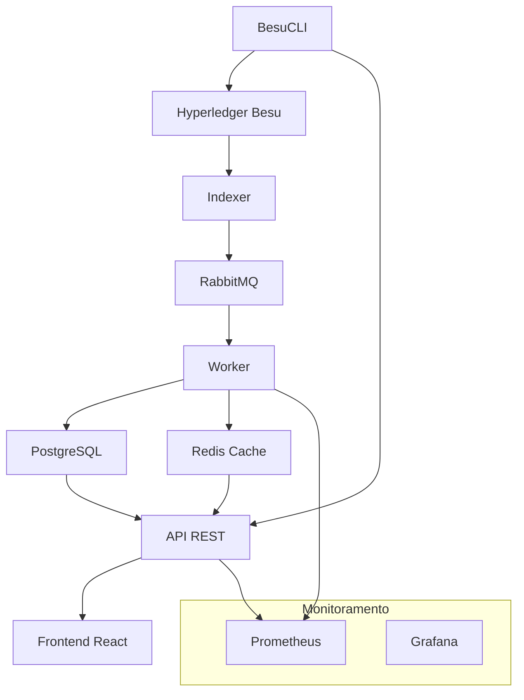

# 🔍 BesuScan - Documentação Completa


> **Block Explorer completo para Hyperledger Besu com monitoramento QBFT em tempo real, rastreamento de transações e análise da rede**

## 📋 Índice da Documentação

### 🏗️ Arquitetura e Conceitos
- [**Arquitetura Geral**](./01-arquitetura.md) - Visão geral da arquitetura em microsserviços
- [**Fluxo de Dados**](./02-fluxo-dados.md) - Como os dados fluem pelo sistema
- [**Tecnologias Utilizadas**](./03-tecnologias.md) - Stack completo e justificativas

### 🔧 Componentes Principais
- [**Indexer**](./04-indexer.md) - Listener da blockchain e captura de eventos
- [**Worker**](./05-worker.md) - Processador de eventos e persistência
- [**API REST**](./06-api.md) - Interface HTTP para consulta de dados
- [**Frontend React**](./07-frontend.md) - Interface web do block explorer

### 🛠️ Ferramentas e Utilitários
- [**BesuCLI**](./08-besucli.md) - CLI para deploy e gestão de contratos
- [**Banco de Dados**](./09-database.md) - Estrutura e DDL do PostgreSQL
- [**Infraestrutura**](./10-infraestrutura.md) - Docker, K8s e deploy

### 📖 Guias Práticos
- [**Início Rápido**](./11-inicio-rapido.md) - Como rodar o projeto localmente
- [**Configuração**](./12-configuracao.md) - Variáveis de ambiente e settings
- [**Desenvolvimento**](./13-desenvolvimento.md) - Como contribuir e desenvolver
- [**Troubleshooting**](./14-troubleshooting.md) - Solução de problemas comuns

### 🚀 Deploy e Produção
- [**Deploy Local**](./15-deploy-local.md) - Docker Compose para desenvolvimento
- [**Deploy Kubernetes**](./16-deploy-k8s.md) - Produção com K8s
- [**Monitoramento**](./17-monitoramento.md) - Métricas e observabilidade
- [**Backup e Recuperação**](./18-backup.md) - Estratégias de backup

## 🎯 O que é o BesuScan?

O **BesuScan** é um block explorer completo e moderno para redes **Hyperledger Besu**, projetado para oferecer:

### ✨ Funcionalidades Principais

- 🔍 **Exploração de Blocos e Transações** - Interface intuitiva para navegar pela blockchain
- ⚡ **Monitoramento em Tempo Real** - WebSocket para atualizações instantâneas
- 🏛️ **Consenso QBFT/IBFT** - Suporte nativo para consenso Byzantine Fault Tolerant
- 📊 **Analytics Avançados** - Métricas e estatísticas da rede
- 🔐 **Smart Contracts** - Deploy, verificação e interação com contratos
- 👥 **Gestão de Contas** - Rastreamento de EOAs e Smart Accounts
- 🏷️ **Sistema de Tags** - Classificação e organização de endereços
- 🔄 **Account Abstraction** - Suporte completo para ERC-4337

### 🏗️ Arquitetura em Microsserviços



### 🚀 Características Técnicas

- **Linguagem Backend**: Go (alta performance e concorrência)
- **Frontend**: React + TypeScript + Tailwind CSS
- **Banco de Dados**: PostgreSQL (dados estruturados) + Redis (cache)
- **Mensageria**: RabbitMQ (processamento assíncrono)
- **Deploy**: Docker + Kubernetes
- **Monitoramento**: Prometheus + Grafana

## 🎪 Demonstração

### 🌐 Interface Web
- **Dashboard Principal**: Visão geral da rede com métricas em tempo real
- **Explorador de Blocos**: Navegação intuitiva pelos blocos da blockchain
- **Rastreador de Transações**: Detalhes completos de cada transação
- **Gestão de Contratos**: Deploy, verificação e interação
- **Analytics**: Gráficos e estatísticas avançadas

### 💻 CLI Poderosa
```bash
# Deploy de contrato ERC-20
besucli deploy token.yml

# Interação com contrato
besucli interact 0x123... --read balanceOf 0x456...

# Verificação de contrato
besucli verify 0x123... --source MyToken.sol
```

## 🌟 Diferenciais

### ⚡ Performance
- **Indexação em Tempo Real**: Captura eventos instantaneamente
- **Processamento Paralelo**: Workers Go com alta concorrência
- **Cache Inteligente**: Redis para consultas frequentes
- **Batch Processing**: Otimizações para alta throughput

### 🔒 Segurança
- **Autenticação JWT**: Sistema de autenticação robusto
- **Rate Limiting**: Proteção contra abuso da API
- **Validação Rigorosa**: Sanitização de todos os inputs
- **CORS Configurável**: Controle de acesso por origem

### 🎨 Experiência do Usuário
- **Interface Moderna**: Design responsivo e intuitivo
- **Busca Inteligente**: Encontre qualquer hash, endereço ou transação
- **Temas Dark/Light**: Personalização visual
- **PWA Ready**: Funciona offline e pode ser instalado

### 🔧 Extensibilidade
- **API REST Completa**: Integração fácil com sistemas externos
- **WebSocket**: Dados em tempo real para aplicações
- **Plugins**: Sistema extensível para funcionalidades customizadas
- **Multi-network**: Suporte para múltiplas redes Besu

## 📊 Casos de Uso

### 🏢 Empresas
- **Auditoria Blockchain**: Rastreamento completo de transações
- **Compliance**: Relatórios e análises para regulamentação
- **Monitoramento**: Alertas e métricas de rede
- **Desenvolvimento**: Ferramenta para debugar contratos

### 👩‍💻 Desenvolvedores
- **Deploy de Contratos**: Interface amigável para deployment
- **Debug de Transações**: Análise detalhada de falhas
- **Testing**: Ambiente para testar contratos
- **Analytics**: Métricas de performance dos contratos

### 🎓 Pesquisadores
- **Análise de Dados**: Export de dados para pesquisa
- **Visualizações**: Gráficos e métricas personalizadas
- **APIs**: Acesso programático aos dados
- **Histórico Completo**: Dados desde o bloco genesis

## 🚀 Começando

Para começar a usar o BesuScan, consulte nosso [**Guia de Início Rápido**](./11-inicio-rapido.md).

### Instalação Rápida
```bash
# Clone o repositório
git clone https://github.com/hubweb3/besuscan-explorer.git
cd besuscan-explorer

# Inicie os serviços
docker-compose -f docker-compose.dev.yml up -d

# Acesse http://localhost:3002
```

## 🤝 Comunidade e Suporte

- 📧 **Email**: suporte@besuscan.com
- 💬 **Discord**: [BesuScan Community](https://discord.gg/besuscan)
- 🐛 **Issues**: [GitHub Issues](https://github.com/hubweb3/besuscan-explorer/issues)
- 📚 **Wiki**: [Documentação Completa](https://docs.besuscan.com)

## 📄 Licença

Este projeto está licenciado sob a **MIT License** - veja o arquivo [LICENSE](../LICENSE) para detalhes.

---

**Desenvolvido com ❤️ pela equipe HubWeb3**

[🏠 Voltar ao Início](#-besuscan---documentação-completa)
